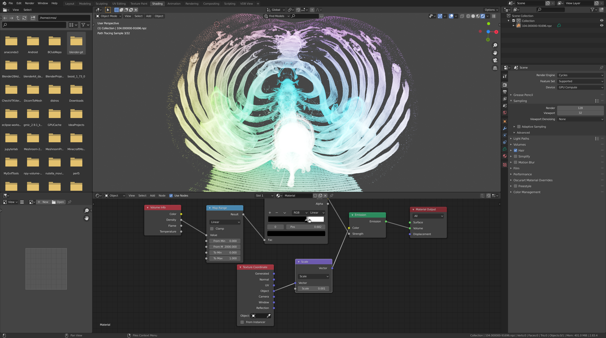

# npy-volume-viewer
View your 3D numpy arrays in Blender3D. 4D on the way.

All Lung CT scan data from RIDER Lung CT dataset: https://wiki.cancerimagingarchive.net/display/Public/RIDER+Lung+CT

## Environment/Install
Install Blender3D: a 3D graphics software that can view vdb files
1. Install Blender3D 2.83 from https://blender.org.

Install OpenVDB
1. If you can use docker, install pyopenvdb from instructions on https://github.com/theNewFlesh/docker_pyopenvdb and call it done.
2. If dockder is not an option, (no root or other container service), conda works sometimes... `conda create --name vdbenv python=3.7`
3. `which pip` Should be the pip under your vdb environment folder.
4. `pip install python-dev-tools pyopenvdb`
6. `export LD_LIBRARY_PATH=$LD_LIBRARY_PATH:$CONDA_PREFIX/lib/` Find this folder via `find $CONDA_PREFIX -name libpython3.7m.so.1.0`.
7. `export LD_LIBRARY_PATH=$LD_LIBRARY_PATH:$CONDA_PREFIX/lib/python3.7/site-packages/`. Find this folder via `find $CONDA_PREFIX -name pyopenvdb.so`.
8. Run steps 6 and 7 whenever you create a new terminal, or enter the environment. In a future version, it would be great to make this part automatic.

These steps have installed openvdb on a machine runnign Ubuntu 18.04.4 LTS.

## Hardware Requiremnets
Blender Volumetrics Rendering requires a lot of resourses, so you'll likley need a high end NVIDIA gpu.

## Running

Run `python ./npy-viewer xxxxx.npy yyyyy.npz nnnnn.npy` to view 3D arrays stored in correspoinding .npy/.npz files.

Here, instead of a shebang, the python specified on the commandline is used. This assumes you have activated your vdb environment

Note that to simply convert a npy to a vdb, a tmpdir is created on run, which contains the vdb used by blender.
